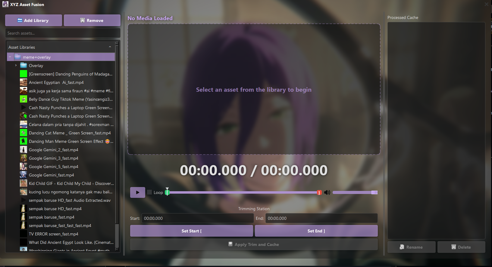

#  XYZ Asset Fusion

> A professional media asset browser with powerful trimming and caching capabilities for editors and creators.

XYZ Asset Fusion is a flagship application from the **XYZ Project**, my self project to doing anything more efficient. It is provided as a standalone, portable `.exe` that requires no installation.

  

## Core Features
*   **Fast Drag & Drop, Trim:** Usable for Video Editor, Sound Editor and Other App Supporting Drag & Drop. 
*   **Professional Glass Pane UI:** A beautiful, modern interface that floats on your desktop.
*   **Multi-Library Asset Browser:** Browse and search multiple media folders in one unified view.
*   **Instant Media Preview:** Double-click any audio or video file for immediate playback and preview.
*   **Frame-Accurate Trimming:** Use the pro-grade slider to precisely select start and end points for your clips.
*   **Non-Destructive Caching:** Trimmed clips are saved as new files in a dedicated cache, leaving your original source files untouched.
*   **Standalone & Portable:** A single executable file that runs on any modern Windows machine. No installation needed.

## How to Use

The workflow is designed to be simple and intuitive for a fast turnaround:

1.  **Add a Library:** Launch the application and click `Add Library`. Select a folder on your computer that contains your video or audio assets.
2.  **Browse and Select:** Your media will appear in the library panel. Double-click any file to load it into the previewer.
3.  **Trim Your Asset:** Use the playback controls and the professional trim slider to define the exact portion of the media you want to clip. Click `Apply Trim and Cache`.
4.  **Use Your Cached Clip:** Your new, trimmed clip will appear in the "Processed Cache" panel on the right. You can now drag and drop it directly from the application into your video editor or any other folder.

### Where Your Files Are Stored

All your trimmed clips, thumbnails, and the application's log file are stored securely and automatically in a dedicated folder within your user's Documents directory:
`Your Documents Folder\XYZ Project\XYZ Asset Fusion\`

---

